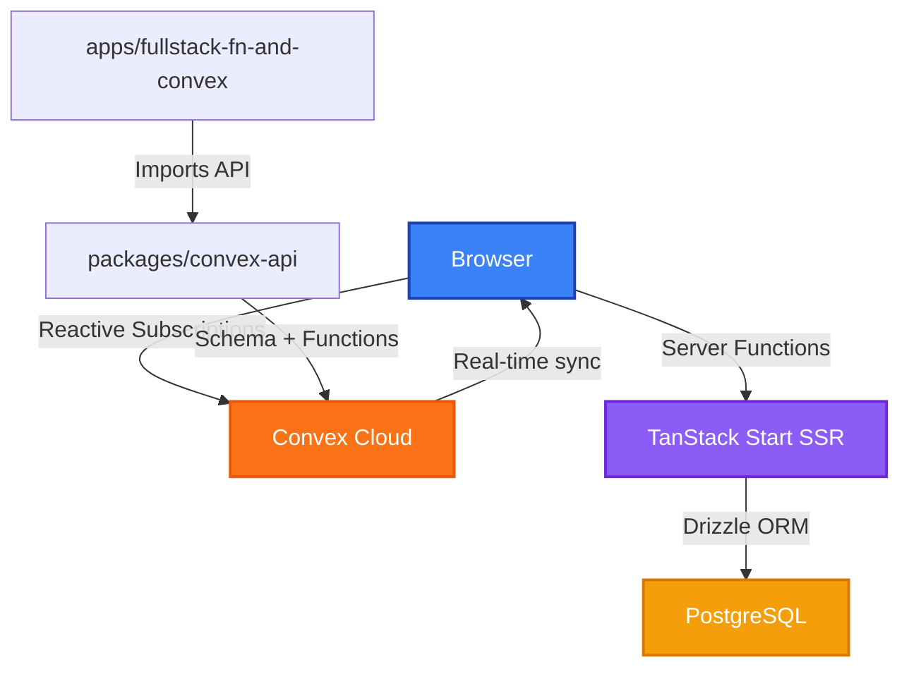
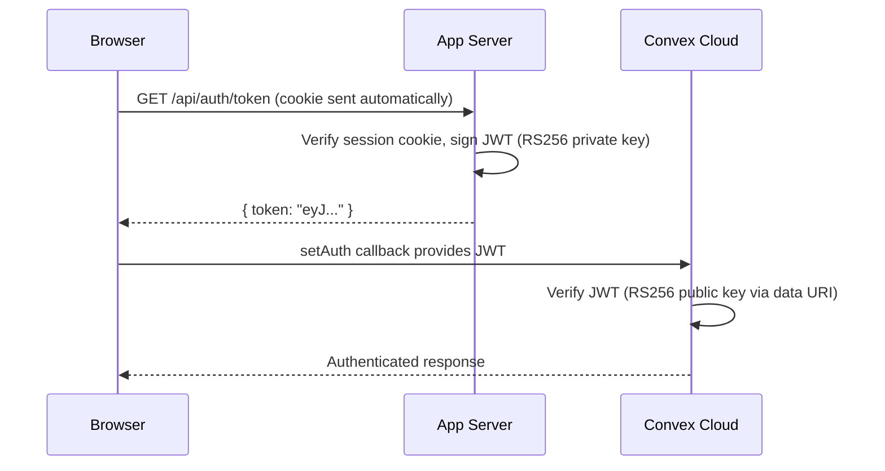

## Overview

Convex provides a **real-time reactive backend** for features that benefit from live updates — like categories, collaborative data, or any entity where multiple users need to see changes instantly. It runs alongside the existing Drizzle/PostgreSQL stack, not as a replacement.

Convex lives in a **dedicated app** (`apps/fullstack-fn-and-convex/`) separate from the main `apps/web/`. This keeps the main web app lean and lets us test the hybrid pattern (TanStack server functions + Convex) in isolation.

## Architecture



### Hybrid Model

The app uses **two backends** simultaneously:

| Backend                                 | Used For                             | Data                  |
| --------------------------------------- | ------------------------------------ | --------------------- |
| **Convex**                              | Real-time reactive data (categories) | Lives in Convex Cloud |
| **TanStack Server Functions + Drizzle** | Traditional CRUD (todos, auth)       | Lives in PostgreSQL   |

This is intentional — Convex handles features that benefit from real-time subscriptions, while the existing Drizzle stack handles everything else.

## Package Structure

### `packages/convex-api/`

The Convex backend package. Contains schema definitions and server functions (queries, mutations, actions).

```
packages/convex-api/
├── convex/
│   ├── schema.ts          # Table definitions
│   ├── categories.ts      # Queries + mutations (with auth checks)
│   ├── auth.config.ts     # JWT authentication config
│   ├── convex.config.ts   # Convex app configuration
│   ├── tsconfig.json
│   └── _generated/        # Auto-generated types (run `npx convex dev`)
│       ├── api.d.ts        # Typed API references
│       ├── api.js
│       ├── dataModel.d.ts  # Table type definitions
│       ├── server.d.ts
│       └── server.js
└── package.json
```

**Important**: The `_generated/` directory is created by running `npx convex dev` or `bun run dev:convex:setup`. You must run this after any schema change.

### `apps/fullstack-fn-and-convex/`

A clone of `fullstack-fn-only` with Convex wired in. Runs on **port 3004** (inspector 9234).

Key differences from the base app:

| File                          | What Changed                                                                        |
| ----------------------------- | ----------------------------------------------------------------------------------- |
| `src/router.tsx`              | Creates `ConvexQueryClient`, passes to `createQueryClient()`, calls `.connect()`    |
| `src/lib/query-client.ts`     | Accepts `ConvexQueryClient`, sets `queryKeyHashFn` and `queryFn` in default options |
| `src/routes/__root.tsx`       | Wraps the app in `ConvexProvider`, wires JWT auth via `setAuth`                     |
| `src/lib/auth/auth-server.ts` | Better Auth with `jwt()` plugin and static key adapter                              |
| `src/lib/auth/auth-client.ts` | Auth client with `jwtClient()` plugin                                               |
| `src/env/client.ts`           | Parses `VITE_CONVEX_URL` from env                                                   |
| `src/hooks/use-categories.ts` | Convex query + mutation hooks                                                       |

## React Query Integration

Convex integrates with TanStack React Query through `@convex-dev/react-query`. This means Convex queries participate in the same cache, devtools, and suspense boundaries as regular queries.

### How It Works

The `ConvexQueryClient` bridges Convex's real-time subscriptions with React Query's cache:

1. **Setup**: `ConvexQueryClient` is created in `router.tsx` and connected to the `QueryClient`
2. **Queries**: Use `convexQuery()` to create query options compatible with `useQuery()`
3. **Mutations**: Use `useMutation()` from `convex/react` directly (no React Query wrapper exists for writes)

### Reads (Queries)

```typescript
import { convexQuery } from "@convex-dev/react-query";
import { useQuery } from "@tanstack/react-query";
import { api } from "@monorepo-template/convex-api/convex/_generated/api";

// This query auto-updates when data changes on the server
const { data } = useQuery(convexQuery(api.categories.list, {}));
```

### Writes (Mutations)

```typescript
import { useMutation } from "convex/react";
import { api } from "@monorepo-template/convex-api/convex/_generated/api";

const createCategory = useMutation(api.categories.create);

// Returns a promise — use async/await, NOT .mutate()
await createCategory({ name: "Work", type: "general" });
```

**Why `convex/react` for mutations?** The `@convex-dev/react-query` package only provides React Query adapters for reads (`convexQuery`, `convexAction`). Writes must go through Convex's own transactional mutation pipeline. This is by design — Convex mutations are transactional and automatically trigger reactive query updates.

## Current Schema

```typescript
// packages/convex-api/convex/schema.ts
defineSchema({
  categories: defineTable({
    name: v.string(),
    type: v.union(v.literal("general"), v.literal("user-personal")),
  }).index("by_type", ["type"]),
});
```

### Available Functions

| Function            | Type     | Args                                      | Returns        |
| ------------------- | -------- | ----------------------------------------- | -------------- |
| `categories.list`   | Query    | `{ type?: "general" \| "user-personal" }` | Category array |
| `categories.create` | Mutation | `{ name, type }`                          | Category ID    |
| `categories.update` | Mutation | `{ id, name?, type? }`                    | null           |
| `categories.remove` | Mutation | `{ id }`                                  | null           |

## Authentication (JWT Bridge)

Convex runs in the cloud and can't read Better Auth's session cookies from PostgreSQL. A **JWT bridge** solves this: Better Auth signs JWTs with a static RSA key pair, and Convex verifies them using the embedded public key (data URI). No tunnels, no public URLs needed for development.

### How It Works



### Key Setup

1. **Generate keys** (one-time): `bun run generate:convex-jwt-keys`
2. **App `.env`**: Set `JWT_PRIVATE_JWK` and `JWT_KID`
3. **Convex env vars**: Set `AUTH_ISSUER` (= `BETTER_AUTH_URL`) and `JWKS_DATA_URI` via `npx convex env set`

### Server Configuration (`auth-server.ts`)

The Better Auth `jwt()` plugin is configured with:

- **`alg: "RS256"`** — RSA signing algorithm
- **`disablePrivateKeyEncryption: true`** — required because the JWK is stored as plain JSON in env vars (not encrypted with `BETTER_AUTH_SECRET`)
- **`issuer`** = `BETTER_AUTH_URL` — must match `AUTH_ISSUER` in Convex exactly (no trailing slash mismatch)
- **`audience: "convex"`** — must match `applicationID` in Convex's `auth.config.ts`
- **`expirationTime: "1h"`** — token lifetime
- **`definePayload`** — adds `email` and `name` to the JWT claims
- **Custom `adapter`** — returns the static key from env instead of querying the DB, bypassing Better Auth's `jwks` table entirely (no migration needed)

The public key is derived from the private key by extracting only `kty`, `n`, `e`, `kid`, `alg`, `use`.

### Client Configuration (`auth-client.ts`)

The `jwtClient()` plugin is added to enable the token endpoint on the client.

### Token Fetching (`__root.tsx`)

```typescript
// When authenticated, provide Convex with a token fetcher callback
convexQueryClient.convexClient.setAuth(async () => {
  const res = await fetch("/api/auth/token", { credentials: "include" });
  if (!res.ok) return null;
  const data = await res.json();
  return data.token ?? null;
});

// When not authenticated, clear auth
convexQueryClient.convexClient.clearAuth();
```

The `setAuth` callback is called by Convex internally whenever it needs a fresh token (before requests, on expiration). The endpoint path is `/api/auth/token` — called directly via `fetch` because the Better Auth client proxy maps `getToken` to `/get-token` which doesn't match the server's registered path.

### Convex Auth Config (`auth.config.ts`)

```typescript
{
  type: "customJwt",
  issuer: process.env.AUTH_ISSUER,       // Must match BETTER_AUTH_URL
  applicationID: "convex",               // Must match jwt.audience
  algorithm: "RS256",
  jwks: process.env.JWKS_DATA_URI,       // data: URI with public key
}
```

The `JWKS_DATA_URI` is a `data:application/json,...` URI containing the JWKS JSON with the public key. This avoids HTTP fetching entirely — works identically in localhost dev and production.

### Identity in Convex Functions

```typescript
const identity = await ctx.auth.getUserIdentity();
// identity.subject    — Better Auth user ID (from JWT "sub" claim)
// identity.email      — user email (from definePayload)
// identity.name       — user name (from definePayload)
// identity.issuer     — BETTER_AUTH_URL (from JWT "iss" claim)
// identity.tokenIdentifier — "<issuer>|<subject>" (Convex-generated unique key)
```

The `subject` field is the user ID. The name comes from the JWT spec (RFC 7519) where `sub` is the standard claim for "who this token represents". Convex maps `sub` → `identity.subject`.

### Auth Checks in Mutations

Mutations that modify data require authentication. Queries can remain public for read-only access:

```typescript
// Protected mutation
export const create = mutation({
  handler: async (ctx, args) => {
    const identity = await ctx.auth.getUserIdentity();
    if (!identity) throw new Error("Not authenticated");
    // ... proceed with mutation
  },
});

// Public query (no auth required)
export const list = query({
  handler: async (ctx, args) => {
    return await ctx.db.query("categories").collect();
  },
});
```

## Environment Variables

The app needs these env vars in `apps/fullstack-fn-and-convex/.env`:

```bash
# Convex
VITE_CONVEX_URL=https://your-deployment.convex.cloud

# JWT Bridge (generate with: bun run generate:convex-jwt-keys)
JWT_PRIVATE_JWK='{"kty":"RSA","n":"...","e":"AQAB",...}'
JWT_KID=your-key-id-uuid
```

Additionally, set these on the Convex deployment:

```bash
npx convex env set AUTH_ISSUER http://localhost:3004    # must match BETTER_AUTH_URL
npx convex env set JWKS_DATA_URI 'data:application/json,...'
```

The env schemas live in `packages/infra-env/` — `fullstack-convex-client.ts` validates `VITE_CONVEX_URL` and `fullstack-server.ts` validates `JWT_PRIVATE_JWK` + `JWT_KID`.

## Development Commands

```bash
# Start the Convex dev server (watches for schema/function changes)
bun run dev:convex

# Initial setup (configure Convex project, generate types)
bun run dev:convex:setup

# Start the fullstack app
bun run dev:fullstack-convex
```

## Port Allocation

| App                         | Vite Port | Inspector Port |
| --------------------------- | --------- | -------------- |
| web                         | 3001      | —              |
| fullstack-fn-only           | 3002      | 9232           |
| **fullstack-fn-and-convex** | **3004**  | **9234**       |

## Gotchas

- **`_generated/` must be regenerated** after any schema or function change. Run `bun run dev:convex` to keep it in sync during development.
- **Mutations return async functions**, not React Query mutation objects. Use `await createCategory(args)` with try/catch, not `.mutate(args, { onSuccess })`.
- **`ConvexQueryClient` must wire into React Query's `defaultOptions`** — specifically `queryKeyHashFn` and `queryFn`. Without this, Convex queries won't subscribe to real-time updates.
- **Convex is NOT in `apps/web`**. It was intentionally removed from the main web app to keep concerns separated. Only `apps/fullstack-fn-and-convex` has Convex dependencies.
- **`disablePrivateKeyEncryption: true`** is required in the JWT plugin config — without it, Better Auth tries to decrypt the plain JWK string using `BETTER_AUTH_SECRET` and fails.
- **`AUTH_ISSUER` must exactly match `BETTER_AUTH_URL`** — including protocol and port, no trailing slash mismatch.
- **Token endpoint is `/api/auth/token`**, not `/api/auth/get-token` — the Better Auth client proxy converts `getToken` to `/get-token`, but the server registers the path as `/token`. Call it directly via `fetch`.
- **`identity.subject`** is the user ID — it comes from the JWT `sub` claim (RFC 7519 convention). Don't look for a `userId` field on the Convex identity object.
