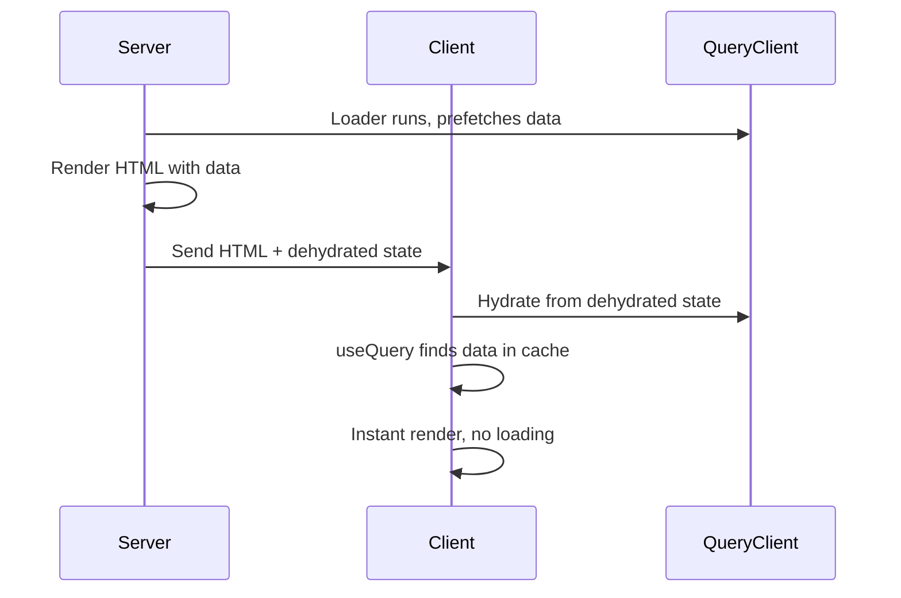
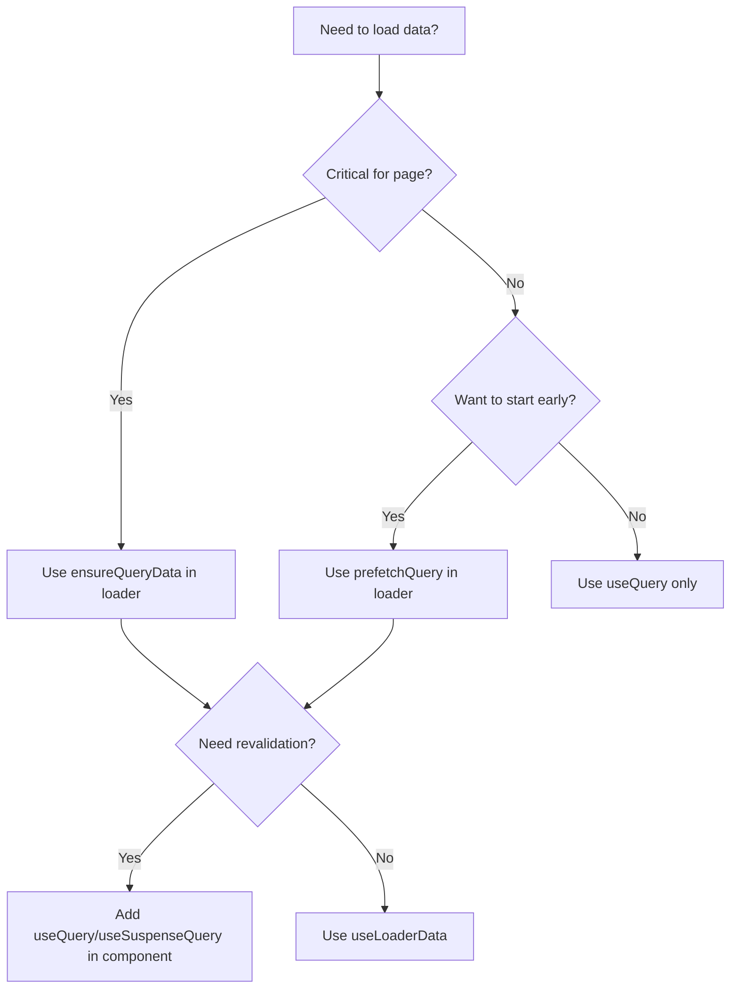

## Overview

This guide covers best practices for data loading in TanStack Start applications, focusing on the integration between TanStack Router loaders and TanStack Query.

## Server Loaders vs useQuery

### When to Use Server Loaders

| Aspect           | Server Loader           | useQuery                       |
| ---------------- | ----------------------- | ------------------------------ |
| Initial paint    | Faster (data in HTML)   | Slower (loading spinner)       |
| Navigation       | Blocks until data ready | Instant, shows loading         |
| SEO              | Better (SSR content)    | Requires extra setup           |
| Revalidation     | Manual                  | Automatic (staleTime, focus)   |
| Cache management | Basic                   | Advanced (dedup, invalidation) |

### Recommended Approach: Hybrid

Combine both for optimal UX:

- **Loaders** for initial data prefetching
- **useQuery** for cache management and revalidation

## Setting Up the Integration

### 1. Router with QueryClient

```typescript
// app/router.tsx
import { routerWithQueryClient } from "@tanstack/react-router-with-query";
import { QueryClient } from "@tanstack/react-query";
import { createRouter as createTanStackRouter } from "@tanstack/react-router";

export function createRouter() {
  const queryClient = new QueryClient({
    defaultOptions: {
      queries: {
        staleTime: 5 * 60 * 1000, // 5 minutes
        gcTime: 10 * 60 * 1000,   // 10 minutes
      },
    },
  });

  return routerWithQueryClient(
    createTanStackRouter({
      routeTree,
      context: { queryClient },
      defaultPreload: "intent", // Preload on hover
    }),
    queryClient
  );
}
```

### 2. Root Route with Context

```typescript
// app/routes/__root.tsx
import { createRootRouteWithContext } from "@tanstack/react-router";
import type { QueryClient } from "@tanstack/react-query";

interface RouterContext {
  queryClient: QueryClient;
}

export const Route = createRootRouteWithContext<RouterContext>()({
  component: RootComponent,
});
```

## Server Functions

Server functions run **only on the server** but can be called from anywhere (loaders, components, hooks).

### Creating Server Functions

```typescript
// lib/server-functions.ts
import { createServerFn } from "@tanstack/start";

// GET for fetching data
export const getYourEntity = createServerFn("GET", async (id: string) => {
  // Server-only code: DB access, env vars, etc.
  const result = await db.query.yourEntities.findFirst({
    where: eq(yourEntities.id, id),
  });
  return result;
});

// POST for mutations
export const updateYourEntity = createServerFn(
  "POST",
  async (data: { id: string; updates: UpdateInput }) => {
    const result = await db
      .update(yourEntities)
      .set(data.updates)
      .where(eq(yourEntities.id, data.id))
      .returning();
    return result[0];
  }
);
```

### Input Validation

Always validate inputs crossing the network boundary:

```typescript
import { createServerFn } from "@tanstack/start";
import { z } from "zod";

const inputSchema = z.object({
  id: z.string().uuid(),
  page: z.number().min(1).default(1),
  limit: z.number().min(1).max(100).default(10),
});

export const getYourEntities = createServerFn("GET", async (input: unknown) => {
  const validated = inputSchema.parse(input);
  // Use validated.id, validated.page, etc.
});
```

## Query Options Pattern

Define reusable query options that combine query keys with server functions:

```typescript
// hooks/query-options.ts
import { queryOptions } from "@tanstack/react-query";
import { getYourEntity, getYourEntities } from "@/lib/server-functions";

export const yourEntityKeys = {
  all: ["yourEntities"] as const,
  lists: () => [...yourEntityKeys.all, "list"] as const,
  list: (params: PaginationParams) => [...yourEntityKeys.lists(), params] as const,
  details: () => [...yourEntityKeys.all, "detail"] as const,
  detail: (id: string) => [...yourEntityKeys.details(), id] as const,
};

export const yourEntityQueryOptions = (id: string) =>
  queryOptions({
    queryKey: yourEntityKeys.detail(id),
    queryFn: () => getYourEntity(id),
    staleTime: 5 * 60 * 1000,
  });

export const yourEntitiesQueryOptions = (params: PaginationParams) =>
  queryOptions({
    queryKey: yourEntityKeys.list(params),
    queryFn: () => getYourEntities(params),
    staleTime: 10 * 60 * 1000,
  });
```

## Loader Patterns

### Pattern 1: Blocking Prefetch (ensureQueryData)

Use when data is **critical** for the page. Navigation waits for data.

```typescript
// routes/_authenticated/your-entities/$id.tsx
export const Route = createFileRoute("/_authenticated/your-entities/$id")({
  loader: async ({ context: { queryClient }, params: { id } }) => {
    // Blocks navigation until both resolve
    await Promise.all([
      queryClient.ensureQueryData(yourEntityQueryOptions(id)),
      queryClient.ensureQueryData(relatedDetailsQueryOptions(id)),
    ]);
  },
  component: YourEntityDetailPage,
});

function YourEntityDetailPage() {
  const { id } = Route.useParams();
  // Data is already in cache - instant render, no loading state
  const { data } = useSuspenseQuery(yourEntityQueryOptions(id));
  // ...
}
```

### Pattern 2: Non-Blocking Prefetch (prefetchQuery)

Use when you want to **start fetching** but not block navigation.

```typescript
export const Route = createFileRoute("/_authenticated/your-entities/")({
  loader: ({ context: { queryClient } }) => {
    // Fire and forget - doesn't block navigation
    queryClient.prefetchQuery(
      yourEntitiesQueryOptions({ page: 1, limit: 5 })
    );
  },
  component: YourEntitiesComponent,
});

function YourEntitiesComponent() {
  // If prefetch finished, data is in cache - no loading
  // If not, shows loading state and waits for data
  const { data, isLoading } = useQuery(
    yourEntitiesQueryOptions({ page: 1, limit: 5 })
  );
  // ...
}
```

### Pattern 3: Mixed (Critical + Non-Critical)

```typescript
loader: async ({ context: { queryClient }, params: { id } }) => {
  // Start fetching comments ASAP, but don't block
  queryClient.prefetchQuery(commentsQueryOptions(id));

  // Block navigation until main data is ready
  await queryClient.ensureQueryData(yourEntityQueryOptions(id));
},
```

## Hybrid SSR + Client Data

### Syncing Server-Loaded Data with useQuery

When you want first page from server but subsequent pages from client:

```typescript
// routes/_authenticated/your-entities/index.tsx
export const Route = createFileRoute("/_authenticated/your-entities/")({
  loader: async ({ context: { queryClient } }) => {
    // Prime the cache with first page
    await queryClient.ensureQueryData(
      yourEntitiesQueryOptions({ page: 1, limit: 5 })
    );
  },
  component: YourEntitiesComponent,
});

function YourEntitiesComponent() {
  const [pagination, setPagination] = useState({ pageIndex: 0, pageSize: 5 });

  const { data, isLoading } = useQuery({
    ...yourEntitiesQueryOptions({
      page: pagination.pageIndex + 1,
      limit: pagination.pageSize,
    }),
    // Keep previous data while fetching next page
    placeholderData: (previousData) => previousData,
  });

  // First page: instant (from loader cache)
  // Subsequent pages: loading state, then data
}
```

### Why This Works

1. **Loader** calls `ensureQueryData` with queryKey `["yourEntities", "list", { page: 1, limit: 5 }]`
2. **useQuery** uses the same queryKey when `pageIndex === 0`
3. TanStack Query finds data in cache - **no loading spinner**
4. When user navigates to page 2, different queryKey, fetch happens
5. `placeholderData` keeps page 1 visible while page 2 loads

## Dehydration / Hydration (SSR)

TanStack Router + Query integration handles this automatically:



The framework:

1. **Server**: Dehydrates initial queries after render
2. **Client**: Hydrates the cache before React renders
3. **Streaming**: Queries that resolve during SSR are streamed to client

## File Organization

Recommended structure for server-side code:

```
src/
├── lib/
│   ├── server-functions.ts    # createServerFn wrappers
│   └── server/                # Server-only utilities
│       ├── db.server.ts       # Database connections
│       └── auth.server.ts     # Auth utilities
├── hooks/
│   ├── query-options.ts       # Reusable queryOptions
│   └── use-your-entities.ts
└── routes/
    └── _authenticated/
        └── your-entities/
            ├── index.tsx
            └── $id.tsx
```

**File naming conventions:**

- `.server.ts` - Server-only code, never bundled to client
- `.client.ts` - Client-only code
- `.ts` - Isomorphic code (safe for both)

## Important Caveats

### Loaders are Isomorphic

Route loaders run on **both server and client**. Don't put sensitive logic directly in loaders:

```typescript
// BAD - exposes secret to client bundle
loader: async () => {
  const apiKey = process.env.SECRET_API_KEY; // Leaked!
}

// GOOD - server function keeps it server-side
export const getData = createServerFn("GET", async () => {
  const apiKey = process.env.SECRET_API_KEY; // Safe
  return fetch(url, { headers: { Authorization: apiKey } });
});

loader: async ({ context }) => {
  await context.queryClient.prefetchQuery({
    queryKey: ["data"],
    queryFn: getData,
  });
}
```

### Serialization Limits

Data returned from loaders must be serializable. These are **not supported**:

- `undefined` (use `null` instead)
- `Date` objects (use ISO strings)
- `Map`, `Set`, `BigInt`
- `Error` objects
- Functions

Use [superjson](https://github.com/blitz-js/superjson) if you need these types.

### Cache Invalidation

After mutations, invalidate relevant queries:

```typescript
const queryClient = useQueryClient();

const mutation = useMutation({
  mutationFn: updateYourEntity,
  onSuccess: (_, variables) => {
    // Invalidate list and detail
    queryClient.invalidateQueries({ queryKey: yourEntityKeys.lists() });
    queryClient.invalidateQueries({
      queryKey: yourEntityKeys.detail(variables.id)
    });
  },
});
```

## Decision Tree



## Sources

- [Server Functions | TanStack Start Docs](https://tanstack.com/start/latest/docs/framework/react/guide/server-functions)
- [Execution Model | TanStack Start Docs](https://tanstack.com/start/latest/docs/framework/react/guide/execution-model)
- [Using Server Functions and TanStack Query](https://www.brenelz.com/posts/using-server-functions-and-tanstack-query/)
- [TanStack Router Data Loading](https://frontendmasters.com/blog/tanstack-router-data-loading-1/)
- [Prefetching & Router Integration | TanStack Query Docs](https://tanstack.com/query/latest/docs/framework/react/guides/prefetching)
- [Server Rendering & Hydration | TanStack Query Docs](https://tanstack.com/query/latest/docs/framework/react/guides/ssr)
